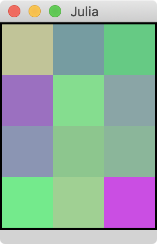

# HueClone.jl

A very simplified clone of "I Love Hue" (http://i-love-hue.com/)

Uses [`Blink.jl`](https://github.com/JunoLab/Blink.jl) to create a simple html/css/js app that talks to the Julia game.

## Installation

```julia
(v1.0) pkg> add https://github.com/NHDaly/HueClone.jl/
```

## Usage

```julia
julia> using HueClone

julia> HueClone.play_blink()  #  To play in a standalone blink window

julia> HueClone.play_juno()  #  To play inside Atom, through the REPL and Plots display.
```



Change the number of squares with the `size` param:


```julia
julia> HueClone.play_blink(size=(6,4))
```
